# Automation Example Diagrams

## Morning Routine Automation

```mermaid
flowchart TD
    START([7:00 AM Weekday]) --> CHECK{Anyone Home?}

    CHECK -->|Yes| BEDROOM[Bedroom Lights<br/>Gradually Brighten]
    CHECK -->|No| END1([Skip Routine])

    BEDROOM --> COFFEE[Smart Plug<br/>Turn On Coffee Maker]
    COFFEE --> THERMO[Thermostat<br/>Set to 72°F]
    THERMO --> BLINDS[Smart Blinds<br/>Open 50%]
    BLINDS --> MUSIC[Play News/Music<br/>on Smart Speaker]
    MUSIC --> NOTIFY[Send Daily Weather<br/>to Phone]
    NOTIFY --> END2([Routine Complete])

    style START fill:#4caf50,color:#fff
    style CHECK fill:#ff9800
    style END2 fill:#4caf50,color:#fff
```



## Security Mode Automation

```mermaid
flowchart TD
    START([All Residents Leave]) --> DETECT{Motion Sensor<br/>Active?}

    DETECT -->|5 min no motion| ARM[Arm Security System]
    DETECT -->|Motion detected| WAIT[Wait 5 minutes]
    WAIT --> DETECT

    ARM --> LIGHTS[Turn Off All Lights]
    LIGHTS --> THERMO[Set Thermostat<br/>to Eco Mode]
    THERMO --> LOCK[Lock Smart Locks]
    LOCK --> CAMERA[Enable Camera<br/>Recording]
    CAMERA --> NOTIFY1[Send Notification<br/>"House Secured"]

    MOTION([Motion Detected<br/>While Away]) --> CHECK{Camera<br/>Identifies Person?}

    CHECK -->|Known Person| LOG[Log Event]
    CHECK -->|Unknown| ALERT[Send Alert + Photo]
    CHECK -->|No Person| LOG

    ALERT --> RECORD[Start Recording]
    ALERT --> SIREN{User Response?}

    SIREN -->|Ignore| LOG
    SIREN -->|Trigger Alarm| ALARM[Sound Siren]

    LOG --> END2([Event Logged])
    NOTIFY1 --> END1([Armed])
    ALARM --> END2
    RECORD --> END2

    style START fill:#2196f3,color:#fff
    style MOTION fill:#f44336,color:#fff
    style ALERT fill:#ff9800
    style ALARM fill:#f44336,color:#fff
```

## Movie Night Scene

```mermaid
flowchart LR
    START([User: "Movie Night"]) --> DIM[Dim Living Room<br/>Lights to 10%]

    DIM --> COLOR[Change Light Color<br/>to Warm White]
    COLOR --> TV[Turn On TV]
    TV --> SOUND[Set Soundbar<br/>to Movie Mode]
    SOUND --> BLIND[Close Blinds]
    BLIND --> THERMO[Adjust Temperature<br/>to 70°F]
    THERMO --> PAUSE[Pause Other<br/>Media Players]
    PAUSE --> DND[Enable Do Not Disturb<br/>on Phones]
    DND --> END([Scene Activated])

    style START fill:#9c27b0,color:#fff
    style END fill:#4caf50,color:#fff
```

## Energy Saving Automation

```mermaid
flowchart TD
    START([Night Time<br/>11:00 PM]) --> OCCUPANCY{Room<br/>Occupied?}

    OCCUPANCY -->|No| LIGHTS_OFF[Turn Off Lights]
    OCCUPANCY -->|Yes| CHECK_NEXT[Check Next Room]

    LIGHTS_OFF --> DEVICES{Devices<br/>in Use?}

    DEVICES -->|TV idle >1hr| TV_OFF[Turn Off TV]
    DEVICES -->|Computer idle| COMP_OFF[Shutdown Computer]
    DEVICES -->|No devices| CONT[Continue]

    TV_OFF --> CONT
    COMP_OFF --> CONT
    CONT --> THERMO_CHECK[Check Thermostat]

    THERMO_CHECK --> SEASON{Season?}
    SEASON -->|Summer| COOL[Set to 78°F]
    SEASON -->|Winter| HEAT[Set to 65°F]

    COOL --> CALCULATE[Calculate Savings]
    HEAT --> CALCULATE

    CALCULATE --> REPORT[Generate Daily<br/>Energy Report]
    REPORT --> END([Send Report<br/>via Email])

    CHECK_NEXT --> OCCUPANCY

    style START fill:#4caf50,color:#fff
    style CALCULATE fill:#2196f3,color:#fff
    style REPORT fill:#ff9800
```


