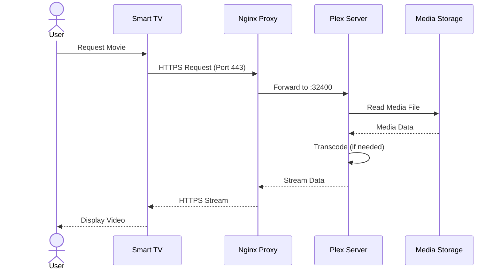
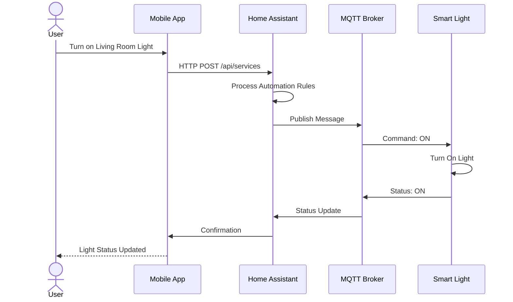
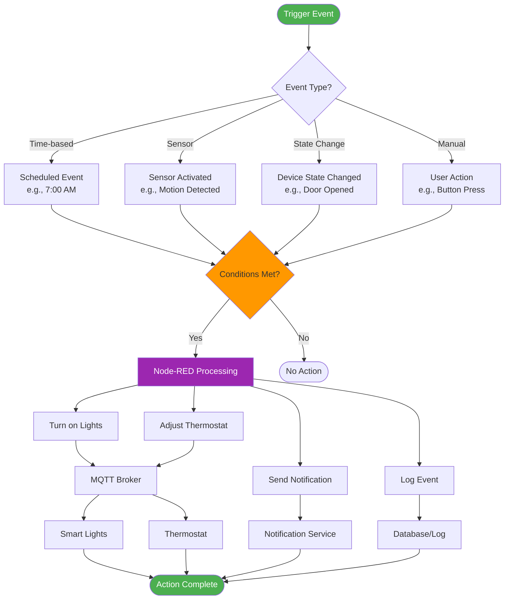
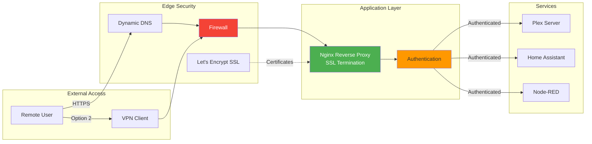

# Data Flow Diagrams

## Media Streaming Flow

```mermaid
sequenceDiagram
    actor User
    participant TV as Smart TV
    participant Nginx as Nginx Proxy
    participant Plex as Plex Server
    participant Storage as Media Storage


    User->>TV: Request Movie
    TV->>Nginx: HTTPS Request (Port 443)
    Nginx->>Plex: Forward to :32400
    Plex->>Storage: Read Media File
    Storage-->>Plex: Media Data
    Plex->>Plex: Transcode (if needed)
    Plex-->>Nginx: Stream Data
    Nginx-->>TV: HTTPS Stream
    TV-->>User: Display Video
```

## Home Automation Flow

```mermaid
sequenceDiagram
    actor User
    participant App as Mobile App
    participant HA as Home Assistant
    participant MQTT as MQTT Broker
    participant Device as Smart Light


    User->>App: Turn on Living Room Light
    App->>HA: HTTP POST /api/services
    HA->>HA: Process Automation Rules
    HA->>MQTT: Publish Message
    MQTT->>Device: Command: ON
    Device->>Device: Turn On Light
    Device->>MQTT: Status: ON
    MQTT->>HA: Status Update
    HA->>App: Confirmation
    App-->>User: Light Status Updated
```

## Automation Trigger Flow

```mermaid
flowchart TD
    START([Trigger Event]) --> CHECK{Event Type?}
   
    CHECK -->|Time-based| TIME[Scheduled Event<br/>e.g., 7:00 AM]
    CHECK -->|Sensor| SENSOR[Sensor Activated<br/>e.g., Motion Detected]
    CHECK -->|State Change| STATE[Device State Changed<br/>e.g., Door Opened]
    CHECK -->|Manual| MANUAL[User Action<br/>e.g., Button Press]
   
    TIME --> EVALUATE{Conditions Met?}
    SENSOR --> EVALUATE
    STATE --> EVALUATE
    MANUAL --> EVALUATE
   
    EVALUATE -->|Yes| NODERED[Node-RED Processing]
    EVALUATE -->|No| END1([No Action])
   
    NODERED --> ACTION1[Turn on Lights]
    NODERED --> ACTION2[Adjust Thermostat]
    NODERED --> ACTION3[Send Notification]
    NODERED --> ACTION4[Log Event]
   
    ACTION1 --> MQTT[MQTT Broker]
    ACTION2 --> MQTT
    ACTION3 --> NOTIFY[Notification Service]
    ACTION4 --> LOG[Database/Log]
   
    MQTT --> DEVICE1[Smart Lights]
    MQTT --> DEVICE2[Thermostat]
   
    DEVICE1 --> END2([Action Complete])
    DEVICE2 --> END2
    NOTIFY --> END2
    LOG --> END2
   
    style START fill:#4caf50,color:#fff
    style EVALUATE fill:#ff9800
    style NODERED fill:#9c27b0,color:#fff
    style END2 fill:#4caf50,color:#fff
```

## Security Flow

```mermaid
flowchart LR
    subgraph "External Access"
        USER[Remote User]
        VPN[VPN Client]
    end
   
    subgraph "Edge Security"
        FW[Firewall]
        DDNS[Dynamic DNS]
        LETSENCRYPT[Let's Encrypt SSL]
    end
   
    subgraph "Application Layer"
        NGINX[Nginx Reverse Proxy<br/>SSL Termination]
        AUTH[Authentication]
    end
   
    subgraph "Services"
        PLEX_S[Plex Server]
        HA_S[Home Assistant]
        NR_S[Node-RED]
    end
   
    USER -->|HTTPS| DDNS
    USER -->|Option 2| VPN
    DDNS --> FW
    VPN --> FW
    FW --> NGINX
    LETSENCRYPT -.->|Certificates| NGINX
    NGINX --> AUTH
   
    AUTH -->|Authenticated| PLEX_S
    AUTH -->|Authenticated| HA_S
    AUTH -->|Authenticated| NR_S
   
    style FW fill:#f44336,color:#fff
    style NGINX fill:#4caf50,color:#fff
    style AUTH fill:#ff9800
```
