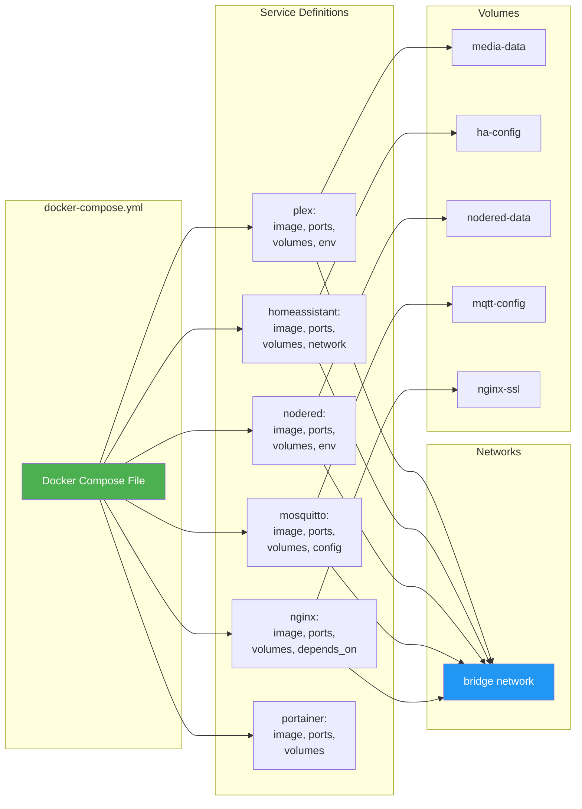
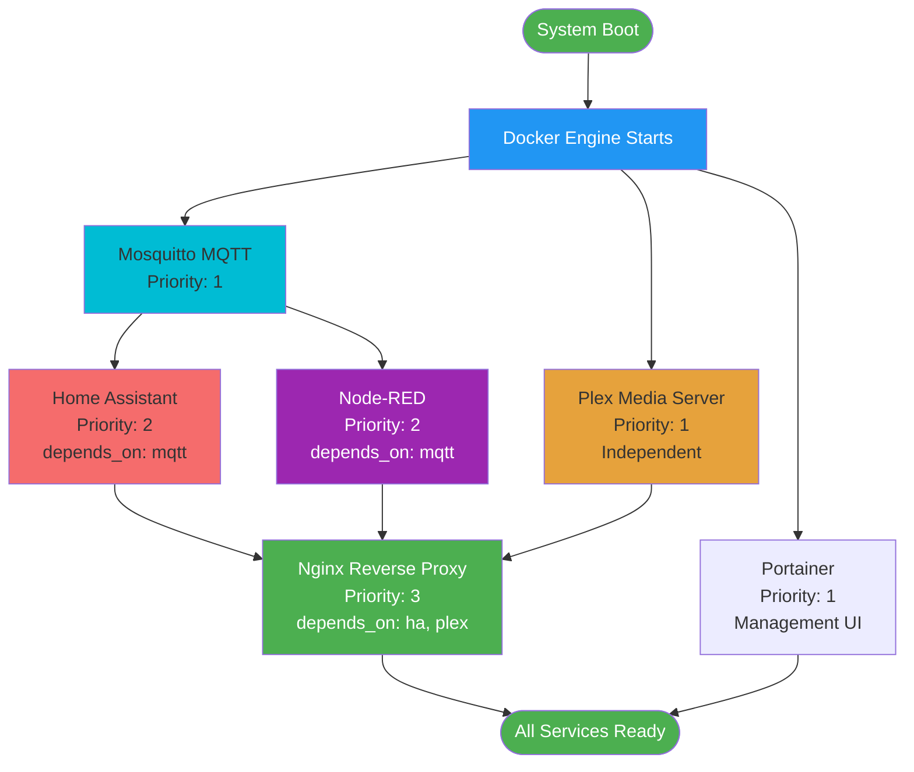

# Deployment Architecture

## Container Deployment

```mermaid
graph TB
    subgraph "Host OS - Ubuntu Server 22.04"
        KERNEL[Linux Kernel]
        DOCKER_ENGINE[Docker Engine]

        subgraph "Docker Containers"
            subgraph "Media Stack"
                PLEX_C[Plex Container<br/>linuxserver/plex<br/>Ports: 32400]
                PLEX_V1[(Media Storage<br/>/media)]
                PLEX_V2[(Config<br/>/config)]
            end

            subgraph "Automation Stack"
                HA_C[Home Assistant<br/>homeassistant/home-assistant<br/>Ports: 8123]
                HA_V1[(Config<br/>/config)]

                NR_C[Node-RED<br/>nodered/node-red<br/>Ports: 1880]
                NR_V1[(Data<br/>/data)]

                MQTT_C[Mosquitto MQTT<br/>eclipse-mosquitto<br/>Ports: 1883, 9001]
                MQTT_V1[(Config<br/>/mosquitto)]
            end

            subgraph "Infrastructure"
                NGINX_C[Nginx Proxy<br/>nginx<br/>Ports: 80, 443]
                NGINX_V1[(SSL Certs<br/>/etc/nginx/ssl)]

                PORTAINER_C[Portainer<br/>portainer/portainer-ce<br/>Ports: 9000]
                PORTAINER_V1[(Data<br/>/data)]

                GRAFANA_C[Grafana<br/>grafana/grafana<br/>Ports: 3000]
                PROM_C[Prometheus<br/>prom/prometheus<br/>Ports: 9090]
            end
        end

        subgraph "Persistent Storage"
            VOLUME_MEDIA[/media/movies<br/>/media/tv<br/>/media/music]
            VOLUME_CONFIG[/docker/configs]
            VOLUME_BACKUP[/backup]
        end
    end

    KERNEL --> DOCKER_ENGINE
    DOCKER_ENGINE --> PLEX_C
    DOCKER_ENGINE --> HA_C
    DOCKER_ENGINE --> NR_C
    DOCKER_ENGINE --> MQTT_C
    DOCKER_ENGINE --> NGINX_C
    DOCKER_ENGINE --> PORTAINER_C
    DOCKER_ENGINE --> GRAFANA_C
    DOCKER_ENGINE --> PROM_C

    PLEX_C --> PLEX_V1
    PLEX_C --> PLEX_V2
    HA_C --> HA_V1
    NR_C --> NR_V1
    MQTT_C --> MQTT_V1
    NGINX_C --> NGINX_V1
    PORTAINER_C --> PORTAINER_V1

    PLEX_V1 -.-> VOLUME_MEDIA
    PLEX_V2 -.-> VOLUME_CONFIG
    HA_V1 -.-> VOLUME_CONFIG
    NR_V1 -.-> VOLUME_CONFIG

    HA_C -.->|API| MQTT_C
    NR_C -.->|Subscribe| MQTT_C

    NGINX_C -.->|Proxy| PLEX_C
    NGINX_C -.->|Proxy| HA_C
    NGINX_C -.->|Proxy| NR_C

    PROM_C -.->|Metrics| HA_C
    PROM_C -.->|Metrics| PLEX_C
    GRAFANA_C -.->|Queries| PROM_C

    style KERNEL fill:#4caf50,color:#fff
    style DOCKER_ENGINE fill:#2196f3,color:#fff
    style PLEX_C fill:#e6a23c
    style HA_C fill:#f56c6c
    style NR_C fill:#9c27b0,color:#fff
    style MQTT_C fill:#00bcd4
```

## Docker Compose Structure



## Service Dependencies


