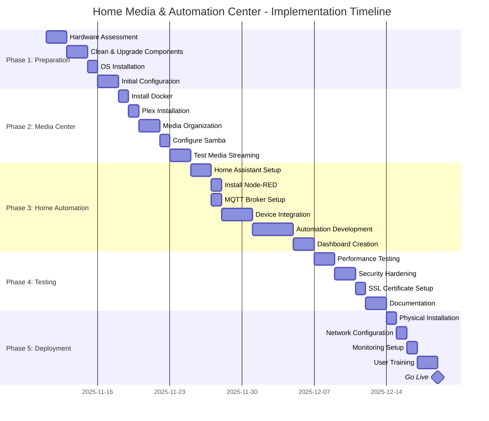
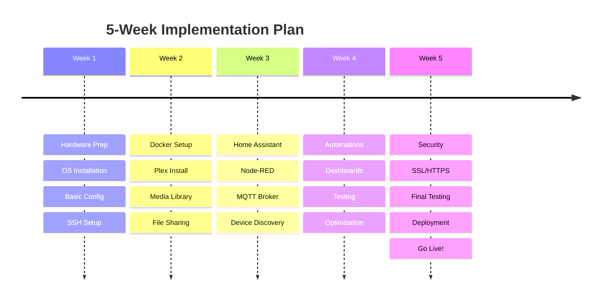

# Implementation Timeline

```mermaid
gantt
    title Home Media & Automation Center - Implementation Timeline
    dateFormat YYYY-MM-DD
    section Phase 1: Preparation
    Hardware Assessment           :p1a, 2025-11-11, 2d
    Clean & Upgrade Components    :p1b, after p1a, 2d
    OS Installation              :p1c, after p1b, 1d
    Initial Configuration        :p1d, after p1c, 2d
   
    section Phase 2: Media Center
    Install Docker               :p2a, after p1d, 1d
    Plex Installation           :p2b, after p2a, 1d
    Media Organization          :p2c, after p2b, 2d
    Configure Samba             :p2d, after p2c, 1d
    Test Media Streaming        :p2e, after p2d, 2d
   
    section Phase 3: Home Automation
    Home Assistant Setup        :p3a, after p2e, 2d
    Install Node-RED            :p3b, after p3a, 1d
    MQTT Broker Setup           :p3c, after p3a, 1d
    Device Integration          :p3d, after p3c, 3d
    Automation Development      :p3e, after p3d, 4d
    Dashboard Creation          :p3f, after p3e, 2d
   
    section Phase 4: Testing
    Performance Testing         :p4a, after p3f, 2d
    Security Hardening          :p4b, after p4a, 2d
    SSL Certificate Setup       :p4c, after p4b, 1d
    Documentation               :p4d, after p4c, 2d
   
    section Phase 5: Deployment
    Physical Installation       :p5a, after p4d, 1d
    Network Configuration       :p5b, after p5a, 1d
    Monitoring Setup            :p5c, after p5b, 1d
    User Training               :p5d, after p5c, 2d
    Go Live                     :milestone, after p5d, 0d
```

## Weekly Breakdown

```mermaid
timeline
    title 5-Week Implementation Plan
   
    Week 1 : Hardware Prep
         : OS Installation
         : Basic Config
         : SSH Setup
         
    Week 2 : Docker Setup
         : Plex Install
         : Media Library
         : File Sharing
         
    Week 3 : Home Assistant
         : Node-RED
         : MQTT Broker
         : Device Discovery
         
    Week 4 : Automations
         : Dashboards
         : Testing
         : Optimization
         
    Week 5 : Security
         : SSL/HTTPS
         : Final Testing
         : Deployment
         : Go Live!
```
