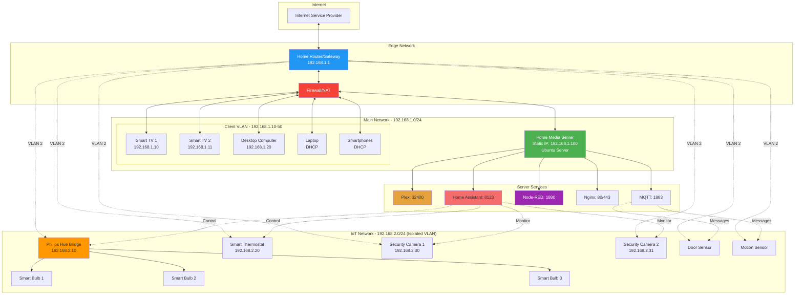
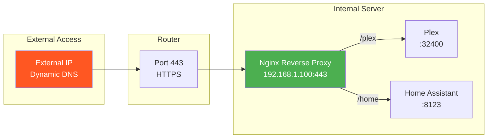

# Network Topology Diagram

```mermaid
graph TB
    subgraph "Internet"
        ISP[Internet Service Provider]
    end


    subgraph "Edge Network"
        ROUTER[Home Router/Gateway<br/>192.168.1.1]
        FW[Firewall/NAT]
    end


    subgraph "Main Network - 192.168.1.0/24"
        SERVER[Home Media Server<br/>Static IP: 192.168.1.100<br/>Ubuntu Server]

        subgraph "Client VLAN - 192.168.1.10-50"
            TV1[Smart TV 1<br/>192.168.1.10]
            TV2[Smart TV 2<br/>192.168.1.11]
            PC[Desktop Computer<br/>192.168.1.20]
            LAPTOP[Laptop<br/>DHCP]
            PHONE[Smartphones<br/>DHCP]
        end
    end


    subgraph "IoT Network - 192.168.2.0/24 (Isolated VLAN)"
        HUB[Philips Hue Bridge<br/>192.168.2.10]
        LIGHT1[Smart Bulb 1]
        LIGHT2[Smart Bulb 2]
        LIGHT3[Smart Bulb 3]
        THERM[Smart Thermostat<br/>192.168.2.20]
        CAM1[Security Camera 1<br/>192.168.2.30]
        CAM2[Security Camera 2<br/>192.168.2.31]
        SENSOR1[Door Sensor]
        SENSOR2[Motion Sensor]
    end


    subgraph "Server Services"
        PLEX_SVC[Plex: 32400]
        HA_SVC[Home Assistant: 8123]
        NR_SVC[Node-RED: 1880]
        NGINX_SVC[Nginx: 80/443]
        MQTT_SVC[MQTT: 1883]
    end


    ISP <--> ROUTER
    ROUTER <--> FW
    FW <--> SERVER
    FW <--> TV1
    FW <--> TV2
    FW <--> PC
    FW <--> LAPTOP
    FW <--> PHONE

    ROUTER -.->|VLAN 2| HUB
    ROUTER -.->|VLAN 2| THERM
    ROUTER -.->|VLAN 2| CAM1
    ROUTER -.->|VLAN 2| CAM2
    ROUTER -.->|VLAN 2| SENSOR1
    ROUTER -.->|VLAN 2| SENSOR2


    HUB --> LIGHT1
    HUB --> LIGHT2
    HUB --> LIGHT3


    SERVER --> PLEX_SVC
    SERVER --> HA_SVC
    SERVER --> NR_SVC
    SERVER --> NGINX_SVC
    SERVER --> MQTT_SVC


    HA_SVC -.->|Control| HUB
    HA_SVC -.->|Control| THERM
    HA_SVC -.->|Monitor| CAM1
    HA_SVC -.->|Monitor| CAM2
    MQTT_SVC -.->|Messages| SENSOR1
    MQTT_SVC -.->|Messages| SENSOR2


    style SERVER fill:#4caf50,color:#fff
    style ROUTER fill:#2196f3,color:#fff
    style FW fill:#f44336,color:#fff
    style HUB fill:#ff9800
    style PLEX_SVC fill:#e6a23c
    style HA_SVC fill:#f56c6c
    style NR_SVC fill:#9c27b0,color:#fff
```

## Port Forwarding Configuration

```mermaid
graph LR
    subgraph "External Access"
        EXT[External IP<br/>Dynamic DNS]
    end


    subgraph "Router"
        PORT443[Port 443<br/>HTTPS]
    end


    subgraph "Internal Server"
        NGINX[Nginx Reverse Proxy<br/>192.168.1.100:443]
        PLEX_INT[Plex<br/>:32400]
        HA_INT[Home Assistant<br/>:8123]
    end


    EXT --> PORT443
    PORT443 --> NGINX
    NGINX -->|/plex| PLEX_INT
    NGINX -->|/home| HA_INT


    style EXT fill:#ff5722,color:#fff
    style NGINX fill:#4caf50,color:#fff
```
