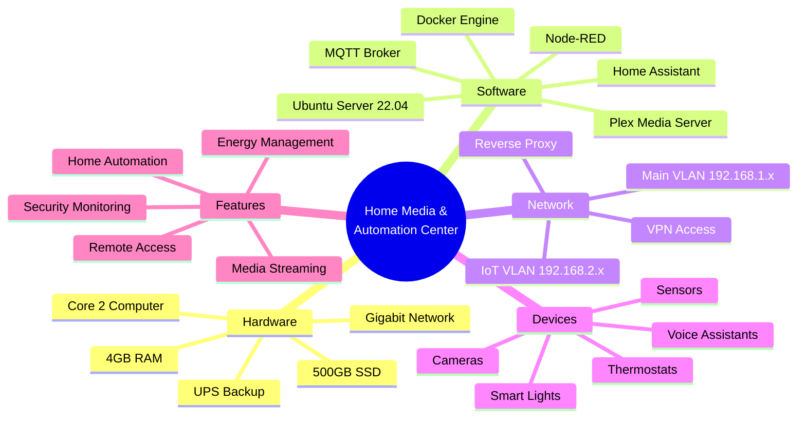
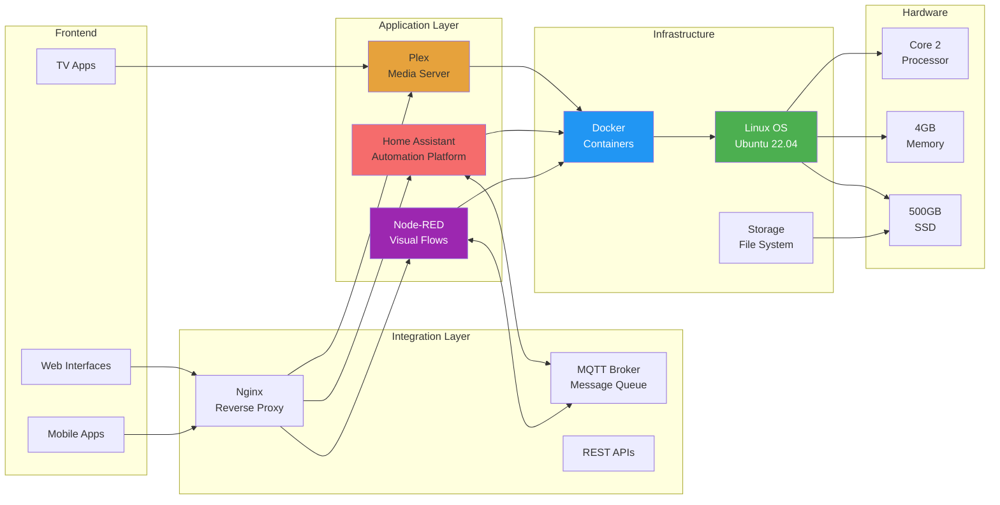
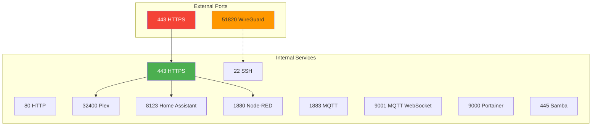
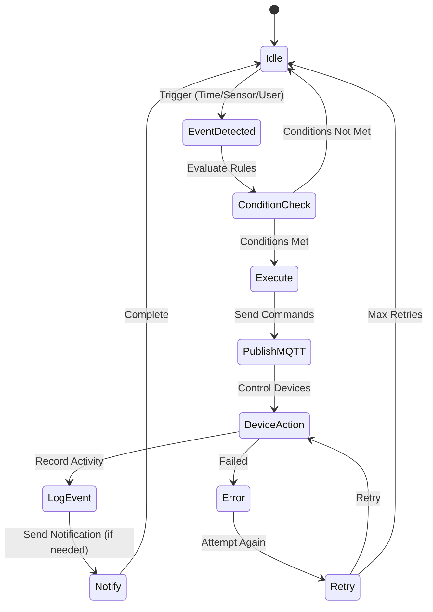
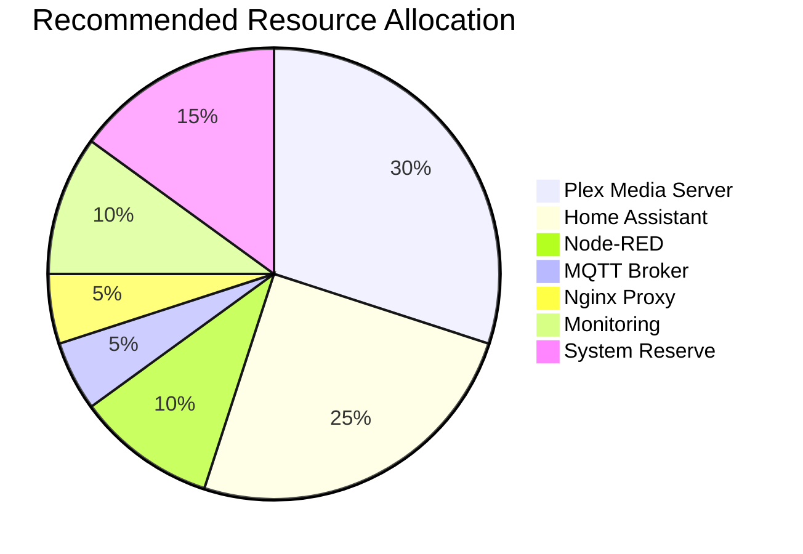
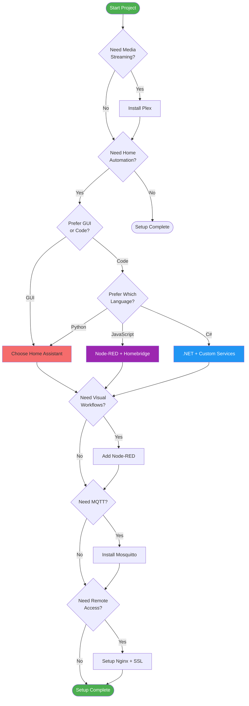
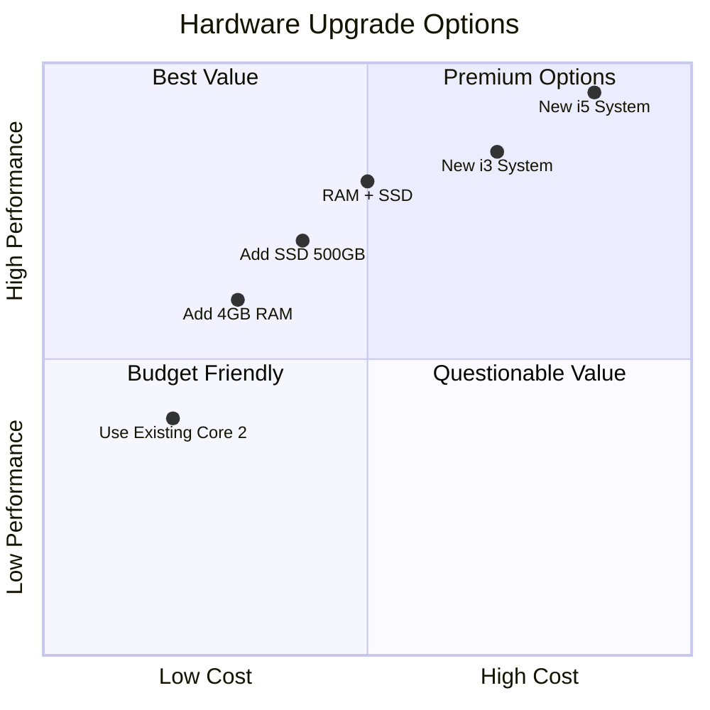

# Quick Reference Diagrams

## Project Structure Overview

## Technology Stack

## Service Port Map

## Automation Flow Summary

## Weekly Maintenance Checklist

```mermaid
gantt
    title Weekly Maintenance Tasks
    dateFormat HH:mm
    axisFormat %H:%M
   
    section Monday
    Check System Updates       :00:00, 15m
    Review Error Logs         :00:15, 15m
   
    section Wednesday
    Backup Configurations     :00:00, 30m
    Test Automations         :00:30, 20m
   
    section Friday
    Monitor Resource Usage    :00:00, 15m
    Update Docker Images      :00:15, 30m
   
    section Sunday
    Full System Backup        :00:00, 1h
    Security Audit           :01:00, 30m
```

## Resource Usage Guidelines

## Decision Tree: Choosing Technologies

## Cost vs Performance Matrix

