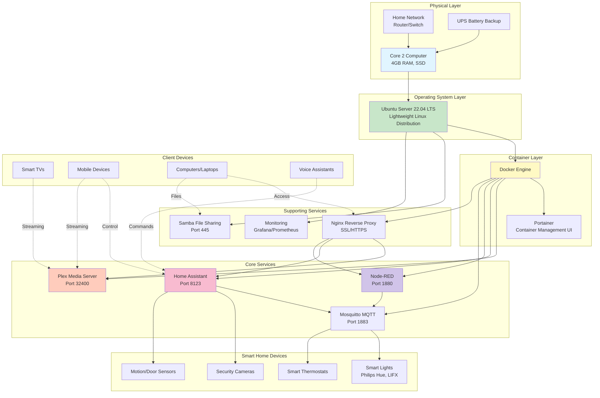

# System Architecture Diagram

```mermaid
graph TB
    subgraph "Physical Layer"
        HW[Core 2 Computer<br/>4GB RAM, SSD]
        NET[Home Network<br/>Router/Switch]
        POWER[UPS Battery Backup]
    end


    subgraph "Operating System Layer"
        OS[Ubuntu Server 22.04 LTS<br/>Lightweight Linux Distribution]
    end


    subgraph "Container Layer"
        DOCKER[Docker Engine]
        PORTAINER[Portainer<br/>Container Management UI]
    end


    subgraph "Core Services"
        PLEX[Plex Media Server<br/>Port 32400]
        HA[Home Assistant<br/>Port 8123]
        NODERED[Node-RED<br/>Port 1880]
        MQTT[Mosquitto MQTT<br/>Port 1883]
    end


    subgraph "Supporting Services"
        NGINX[Nginx Reverse Proxy<br/>SSL/HTTPS]
        SAMBA[Samba File Sharing<br/>Port 445]
        MONITOR[Monitoring<br/>Grafana/Prometheus]
    end


    subgraph "Smart Home Devices"
        LIGHTS[Smart Lights<br/>Philips Hue, LIFX]
        THERMO[Smart Thermostats]
        CAMERA[Security Cameras]
        SENSORS[Motion/Door Sensors]
    end


    subgraph "Client Devices"
        TV[Smart TVs]
        MOBILE[Mobile Devices]
        COMPUTER[Computers/Laptops]
        VOICE[Voice Assistants]
    end


    POWER --> HW
    HW --> OS
    NET --> HW
    OS --> DOCKER
    DOCKER --> PORTAINER
    DOCKER --> PLEX
    DOCKER --> HA
    DOCKER --> NODERED
    DOCKER --> MQTT
    DOCKER --> NGINX
    OS --> SAMBA
    OS --> MONITOR


    HA --> MQTT
    NODERED --> MQTT
    MQTT --> LIGHTS
    MQTT --> THERMO
    HA --> CAMERA
    HA --> SENSORS


    NGINX --> PLEX
    NGINX --> HA
    NGINX --> NODERED


    TV -.->|Streaming| PLEX
    MOBILE -.->|Control| HA
    MOBILE -.->|Streaming| PLEX
    COMPUTER -.->|Access| NGINX
    VOICE -.->|Commands| HA
    COMPUTER -.->|Files| SAMBA


    style HW fill:#e1f5ff
    style OS fill:#c8e6c9
    style DOCKER fill:#fff9c4
    style PLEX fill:#ffccbc
    style HA fill:#f8bbd0
    style NODERED fill:#d1c4e9
```
